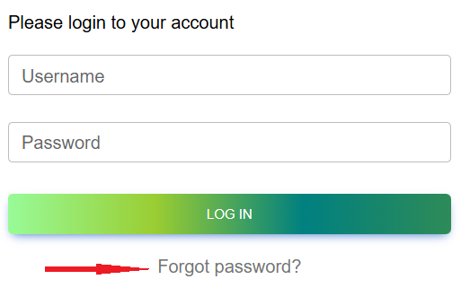
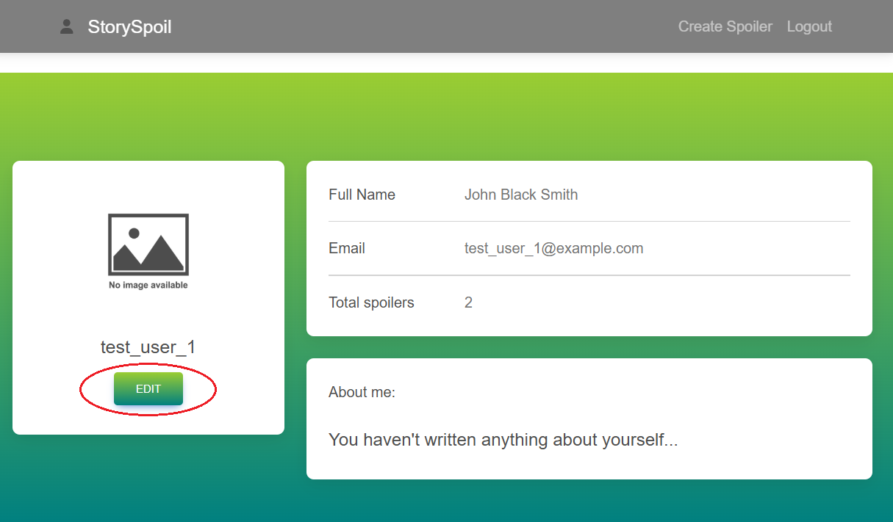

# Bugs Report – Home Page

This file documents all identified bugs related to requirements, use case and test case analysis.
It works in parallel with [queries/queries.md](../queries/queries.md).
Each bug has a unique ID (BUG-XX-XX), is linked to its corresponding Jira issue, GitHub test case(s), and screenshot evidence.
Screenshots are stored in the `docs/screenshots/` folder. All usernames, emails, and other data displayed in screenshots are dummy test data used solely for QA and educational purposes

> ⚠️ Note: Screenshots or excerpts from the original requirements document are omitted due to copyright restrictions. Related issues are described textually without reproducing protected material.

---

## BUG-HP-01 – Missing picture in "Upload a Picture" section

**Jira Bug:** [SSQ-25](https://storyspoilerqa.atlassian.net/browse/SSQ-25)  
**Related Test Case:**  [TC-HP-01](../test-cases/test-cases-home-page.md#tc-hp-01--verify-home-page-for-non-logged-in-users) (Jira link: [SSQ-6](https://storyspoilerqa.atlassian.net/browse/SSQ-6))

### Steps to Reproduce
1. Open the app URL.
2. Scroll to the "Upload a Picture" section on the Home Page.

### Expected Result
The section should display:
- Motivational phrase
- Short description
- Corresponding picture

### Actual Result
The picture is not displayed. Instead, the alt text `"uploading spoiler story picture"` appears.

### Severity
Medium

### Priority
Medium

### Status
Open

### Affected Areas
Home Page (non-logged-in users)

### Screenshot

---

## BUG-HP-02 – Copyright link in footer does not redirect

**Jira Bug:** [SSQ-26](https://storyspoilerqa.atlassian.net/browse/SSQ-26)  
**Related Test Cases:**  
- [TC-HP-07](../test-cases/test-cases-home-page.md#tc-hp-07--verify-copyright-link-in-footer-for-non-logged-in-users) (Jira link: [SSQ-12](https://storyspoilerqa.atlassian.net/browse/SSQ-12)) – Verify Copyright link in footer for non-logged-in users
- [TC-HP-15](../test-cases/test-cases-home-page.md#tc-hp-15--verify-copyright-link-in-footer-for-logged-in-users) – (Jira link: [SSQ-15](https://storyspoilerqa.atlassian.net/browse/SSQ-20)) - Verify Copyright link in footer for logged-in users

### Steps to Reproduce
1. Open the app URL.
2. Scroll to the footer.
3. Click the "StorySpoil" copyright link.

### Expected Result
User is redirected to the dedicated Copyright page.

### Actual Result
The page does not redirect. Instead, the screen scrolls to the top.

### Severity
Medium 

### Priority
High  

### Status
Open  

### Affected Areas
- Home Page (non-logged-in users)  
- Home Page (logged-in users)  
- Any page containing the footer component  

---

## BUG-REG-01 – Validation error message does not specify the correct email address format

**Jira Bug:** [SSQ-56](https://storyspoilerqa.atlassian.net/browse/SSQ-56)  
**Related Test Case:** [TC-REG-08](../test-cases/test-cases-user-registration.md#tc-reg-08--verify-validation-for-invalid-email-missing-) (Jira link: [SSQ-41](https://storyspoilerqa.atlassian.net/browse/SSQ-41))

### Steps to Reproduce
1. Open the app URL.
2. Click the “SIGN UP” button in the navigation bar.
3. In the Email field, enter TD-30 (nvalid email, missing '@' and '.').
4. Fill in all other required fields with valid test data (see TD-07, TD-14, TD-28, TD-17, TD-20, TD-21).
5. Click the “SIGN UP” button.

### Expected Result
A clear validation error message is displayed that specifies the correct email format, including the presence of an `"@"` and a `"."`.

### Actual Result
The validation error message only mentions the `"@"` requirement but does not specify the missing `"."`.

### Severity
Medium

### Priority
High

### Status
Open

### Affected Area
Registration form – Email field

### Screenshot

---

## BUG-REG-02 – User is able to sign up with an invalid email address missing a "."

**Jira Bug:** [SSQ-57](https://storyspoilerqa.atlassian.net/browse/SSQ-57)  
**Related Test Case: ** [TC-REG-08](../test-cases/test-cases-user-registration.md#tc-reg-08--verify-validation-for-invalid-email-missing-) (Jira link: [SSQ-41](https://storyspoilerqa.atlassian.net/browse/SSQ-41))

### Steps to Reproduce
1. Open the app URL.
2. Click the “SIGN UP” button in the navigation bar.
3. Enter an invalid email address without a `"."`, e.g., `test@examplecom`.
4. Fill in all other required fields with valid test data (see TD-07, TD-14, TD-28, TD-17, TD-20, TD-21).
5. Click the “SIGN UP” button.

### Expected Result
The user should not be able to complete the sign-up process. A clear validation error message should be displayed indicating that the email format is invalid.

### Actual Result
The user is successfully registered with an invalid email address. No error message is displayed.

### Severity
High

### Priority
Critical

### Status
Open

### Affected Area
Registration form – Email validation

### Screenshots

---

## BUG-REG-03 – User can sign up with a middle name below the minimum boundary

**Jira Bug:** [SSQ-58](https://storyspoilerqa.atlassian.net/browse/SSQ-58)  
**Related Test Case: ** [TC-REG-13](../test-cases/test-cases-user-registration.md#tc-reg-13--verify-validation-for-invalid-middle-name-too-short) (Jira link: [SSQ-46](https://storyspoilerqa.atlassian.net/browse/SSQ-46))

### Steps to Reproduce
1. Open the app URL.
2. Click the “SIGN UP” button in the navigation bar.
3. Enter a middle name of 1 character, such as `A`, in the Middle Name field.
4. Fill in all other required fields with valid test data (see TD-07, TD-09, TD-14, TD-17, TD-21).
5. Click the “SIGN UP” button.

### Expected Result
The user should not be able to create an account with a middle name shorter than 2 characters. A clear validation error message should be displayed indicating that the middle name must be between 2–60 characters.

### Actual Result
The user is able to create an account with a 1-character middle name. No error message is displayed.

### Severity
Low

### Priority
Medium

### Status
Open

### Affected Area
Registration form – Middle Name field

### Screenshots

---

## BUG-REG-04 – Incorrect field reference in Last Name validation

**Jira Bug:** [SSQ-70](https://storyspoilerqa.atlassian.net/browse/SSQ-70)  
**Related Test Case: ** [TC-REG-15](../test-cases/test-cases-user-registration.md#tc-reg-15--verify-validation-for-invalid-last-name-too-short) (Jira link: [SSQ-48](https://storyspoilerqa.atlassian.net/browse/SSQ-48))

### Steps to Reproduce
1. Open the app URL.
2. Click the “SIGN UP” button in the navigation bar.
3. Enter a last name of 1 character, such as `L`, in the Last Name field.
4. Fill in all other required fields with valid test data (see TD-07, TD-09, TD-14, TD-20, TD-21).
5. Click the “SIGN UP” button.

### Expected Result
A clear validation error message should be displayed indicating that the last name must be at least 2 characters.

### Actual Result
An error message appears under the Last Name field: `"Last name has to be at least 2 symbols!"`.

### Severity
Medium

### Priority
High

### Status
Open

### Affected Area
Registration form – Last Name field validation

### Screenshot

---

## BUG-LOG-01 – “Forgot Password?” link redirects to Home Page instead of Restore Password page 

**Jira Bug:** [SSQ-87](https://storyspoilerqa.atlassian.net/browse/SSQ-87)  
**Related Test Case:** [TC-LOG-06](../test-cases/test-cases-user-registration.md#tc-log-06--verify-create-new-button-redirects-to-sign-up-paget) (Jira link: [SSQ-82](https://storyspoilerqa.atlassian.net/browse/SSQ-82))

### Steps to Reproduce
1. Open the app URL.  
2. Click the "LOG IN" button in the navigation bar.  
3. Click "Forgot Password?" link.

### Expected Result
User is redirected to the Restore Password page, where they can initiate the password recovery process. 

### Actual Result  
User is redirected to the Home page for non-logged-in users; the Restore Password page is not accessible.

### Severity
High 

### Priority
High  

### Status
Open  

### Affected Area:
Log In page – "Forgot Password?" link

### Screenshots

---

## BUG-PROF-01 – “EDIT” button does not open the Edit Profile Info page

**Jira Bug:** [SSQ-99](https://storyspoilerqa.atlassian.net/browse/SSQ-99)  
**Related Test Cases:** 
- [TC-PROF-03](../test-cases/test-cases-user-profile-management.md#tc-prof-03--verify-edit-button-redirects-to-edit-profile-info-page) (Jira link: [SSQ-95](https://storyspoilerqa.atlassian.net/browse/SSQ-95))
- [TC-PROF-04](../test-cases/test-cases-user-profile-management.md#tc-prof-04--verify-edit-profile-info-page) (Jira link: [SSQ-101](https://storyspoilerqa.atlassian.net/browse/SSQ-101))
- [TC-PROF-05](../test-cases/test-cases-user-profile-management.md#tc-prof-05--verify-profile-edit-with-valid-data) (Jira link: [SSQ-96](https://storyspoilerqa.atlassian.net/browse/SSQ-96))
- [TC-PROF-06](../test-cases/test-cases-user-profile-management.md#tc-prof-06--verify-required-fields-validation-when-all-fields-are-empty) (Jira link: [SSQ-97](https://storyspoilerqa.atlassian.net/browse/SSQ-97))
- [TC-PROF-07](../test-cases/test-cases-user-profile-management.md#tc-prof-07--verify-minimum-length-validation-when-editing) (Jira link: [SSQ-102](https://storyspoilerqa.atlassian.net/browse/SSQ-102))
- [TC-PROF-08](../test-cases/test-cases-user-profile-management.md#tc-prof-08--verify-maximum-length-validation-when-editing-the-first-name-field) (Jira link: [SSQ-103](https://storyspoilerqa.atlassian.net/browse/SSQ-103))
- [TC-PROF-09](../test-cases/test-cases-user-profile-management.md#tc-prof-09--verify-minimum-length-validation-when-editing-the-middle-name-field) (Jira link: [SSQ-104](https://storyspoilerqa.atlassian.net/browse/SSQ-104))
- [TC-PROF-10](../test-cases/test-cases-user-profile-management.md#tc-prof-10--verify-maximum-length-validation-when-editing-the-middle-name-field) (Jira link: [SSQ-105](https://storyspoilerqa.atlassian.net/browse/SSQ-105))
- [TC-PROF-11](../test-cases/test-cases-user-profile-management.md#tc-prof-11--verify-minimum-length-validation-when-editing-the-last-name-field) (Jira link: [SSQ-106](https://storyspoilerqa.atlassian.net/browse/SSQ-106))
- [TC-PROF-12](../test-cases/test-cases-user-profile-management.md#tc-prof-12--verify-maximum-length-validation-when-editing-the-last-name-field) (Jira link: [SSQ-107](https://storyspoilerqa.atlassian.net/browse/SSQ-107))
- [TC-PROF-13](../test-cases/test-cases-user-profile-management.md#tc-prof-13--verify-maximum-length-validation-when-editing-the-about-me-field) (Jira link: [SSQ-108](https://storyspoilerqa.atlassian.net/browse/SSQ-108))
- [TC-PROF-14](../test-cases/test-cases-user-profile-management.md#tc-prof-14--verify-validation-for-profile-picture-field-with-invalid-url-missing-protocol) (Jira link: [SSQ-109](https://storyspoilerqa.atlassian.net/browse/SSQ-109))
- [TC-PROF-15](../test-cases/test-cases-user-profile-management.md#tc-prof-15--verify-validation-for-profile-picture-field-with-invalid-url-missing-file-extension) (Jira link: [SSQ-110](https://storyspoilerqa.atlassian.net/browse/SSQ-110))
- [TC-PROF-16](../test-cases/test-cases-user-profile-management.md#tc-prof-16--verify-validation-for-profile-picture-field-with-invalid-url-wrong-extension) (Jira link: [SSQ-111](https://storyspoilerqa.atlassian.net/browse/SSQ-111))
- [TC-PROF-17](../test-cases/test-cases-user-profile-management.md#tc-prof-17--verify-validation-for-profile-picture-field-with-invalid-url-invalid-url-structure) (Jira link: [SSQ-112](https://storyspoilerqa.atlassian.net/browse/SSQ-112))

### Steps to Reproduce
1. Navigate to the app URL.
2. Click “LOG IN” button in the navigation bar.
3. Enter valid credentials (username and password) from TD-02.
4. Click the top-left user profile icon in the navigation bar.
5. Click “EDIT” button.

### Expected Result
User is redirected to the Edit Profile Info page, where they can edit their profile.

### Actual Result
The “EDIT” button does not perform any action. The user remains on the My Profile page; the Edit Profile Info page is not accessible.

### Severity
Blocking 

### Priority
High  

### Status
Open

### Affected Areas
- My Profile Page (Navigation)
- Edit Profile Info Page (Accessibility)

### Screenshot

---

## BUG-SM-01 – Missing "SHARE" button for created spoilers on Home Page

**Jira Bug:** [SSQ-158](https://storyspoilerqa.atlassian.net/browse/SSQ-158)  
**Related Test Cases:**  
- [TC-SM-01](../test-cases/test-cases-spoiler-management.md#tc-sm-01--verify-spoiler-list-and-functional-buttons-on-home-page) (Jira link: [SSQ-138](https://storyspoilerqa.atlassian.net/browse/SSQ-138))
- [TC-SM-04](../test-cases/test-cases-spoiler-management.md#tc-sm-04--verify-share-spoiler-page) (Jira link: [SSQ-141](https://storyspoilerqa.atlassian.net/browse/SSQ-141))
- [TC-SM-05](../test-cases/test-cases-spoiler-management.md#tc-sm-05--verify-spoiler-sharing-with-valid-data) (Jira link: [SSQ-142](https://storyspoilerqa.atlassian.net/browse/SSQ-142))
- [TC-SM-06](../test-cases/test-cases-spoiler-management.md#tc-sm-06--verify-maximum-length-validation-for-message) (Jira link: [SSQ-168](https://storyspoilerqa.atlassian.net/browse/SSQ-168))
- [TC-SM-07](../test-cases/test-cases-spoiler-management.md#tc-sm-07--verify-maximum-length-validation-for-name) (Jira link: [SSQ-169](https://storyspoilerqa.atlassian.net/browse/SSQ-169))
- [TC-SM-08](../test-cases/test-cases-spoiler-management.md#tc-sm-08--verify-validation-for-invalid-email-missing-e) (Jira link: [SSQ-143](https://storyspoilerqa.atlassian.net/browse/SSQ-143))
- [TC-SM-09](../test-cases/test-cases-spoiler-management.md#tc-sm-09--verify-validation-for-invalid-email-missing-) (Jira link: [SSQ-144](https://storyspoilerqa.atlassian.net/browse/SSQ-144))
- [TC-SM-10](../test-cases/test-cases-spoiler-management.md#tc-sm-10--verify-validation-for-invalid-email-missing--and-) (Jira link: [SSQ-145](https://storyspoilerqa.atlassian.net/browse/SSQ-145))
- [TC-SM-11](../test-cases/test-cases-spoiler-management.md#tc-sm-11--verify-validation-for-invalid-email-extra-spaces) (Jira link: [SSQ-146](https://storyspoilerqa.atlassian.net/browse/SSQ-146))
- [TC-SM-12](../test-cases/test-cases-spoiler-management.md#tc-sm-12--verify-validation-for-empty-email-field) (Jira link: [SSQ-147](https://storyspoilerqa.atlassian.net/browse/SSQ-147))
- [TC-SM-13](../test-cases/test-cases-spoiler-management.md#tc-sm-13--verify-validation-for-invalid-email-missing-username) (Jira link: [SSQ-148](https://storyspoilerqa.atlassian.net/browse/SSQ-148))
- [TC-SM-14](../test-cases/test-cases-spoiler-management.md#tc-sm-14--verify-validation-for-invalid-email-missing-domain-name) (Jira link: [SSQ-149](https://storyspoilerqa.atlassian.net/browse/SSQ-149))
- [TC-SM-15](../test-cases/test-cases-spoiler-management.md#tc-sm-15--verify-validation-for-invalid-email-missing-host) (Jira link: [SSQ-150](https://storyspoilerqa.atlassian.net/browse/SSQ-150))
- [TC-SM-16](../test-cases/test-cases-spoiler-management.md#tc-sm-16--verify-validation-for-invalid-email-multiple--symbols) (Jira link: [SSQ-151](https://storyspoilerqa.atlassian.net/browse/SSQ-151))

### Steps to Reproduce
1. Open the app URL.
2. Click the "LOG IN" button in the navigation bar.  
3. Enter valid credentials (username and password) from TD-02.
4. Observe the list of spoilers displayed on the Home Page.

### Expected Result
Each spoiler should display the following buttons: "SHARE", "EDIT", and "DELETE".

### Actual Result
The "SHARE" button is missing for all displayed spoilers. Only "EDIT" and "DELETE" buttons are visible.

### Severity
High

### Priority
High

### Status
Open

### Affected Areas
- Home Page (Logged-in Users)  
- Spoiler Management functionality (Edit option unavailable)

### Screenshot

---

## BUG-SM-02 – Search functionality not working (no action on input or button click)

**Jira Bug:** [SSQ-170](https://storyspoilerqa.atlassian.net/browse/SSQ-170)  
**Related Test Cases:** 
- [TC-SM-29](../test-cases/test-cases-spoiler-management.md#tc-sm-29--verify-that-write-spoiler-button-redirects-to-the-create-spoiler-page) (Jira link: [SSQ-155](https://storyspoilerqa.atlassian.net/browse/SSQ-155))
- [TC-SM-30](../test-cases/test-cases-spoiler-management.md#tc-sm-30--verify-search-functionality-displays-matching-spoilers) (Jira link: [SSQ-156](https://storyspoilerqa.atlassian.net/browse/SSQ-156))
- [TC-SM-31](../test-cases/test-cases-spoiler-management.md#tc-sm-31--verify-search-returns-no-results-for-non-existing-titles) (Jira link: [SSQ-157](https://storyspoilerqa.atlassian.net/browse/SSQ-157))

### Steps to Reproduce
1. Open the app URL.  
2. Click the "LOG IN" button in the navigation bar.  
3. Enter valid credentials (username and password) from TD-02.  
4. Locate the Search field on the Home Page.  
5. Enter any search term — either a matching or non-matching keyword.  
6. Press Enter or click the Search button.

### Expected Result
The system should:
- Display a list of spoilers that match the search term (for matching input).  
- Show a "There are no spoilers :(" message (for non-matching input).  
- Indicate that the search action has been processed (e.g., spinner or filtered list).

### Actual Result
- No action occurs after pressing Enter or clicking the Search button.  
- The list of spoilers remains unchanged.  
- No feedback or error message is displayed.

### Severity
High

### Priority
High

### Status
Open

### Affected Areas
- Spoiler Management (Search functionality)  
- Home Page (Logged-in Users)  

### Screenshots

