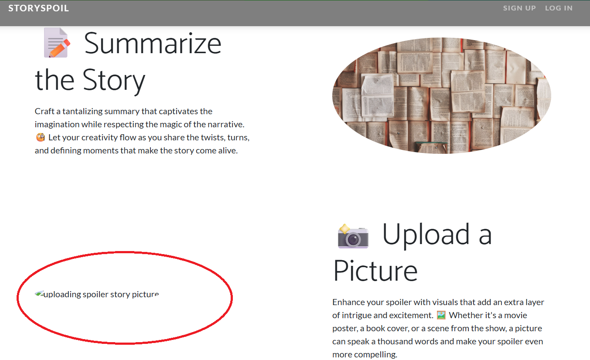
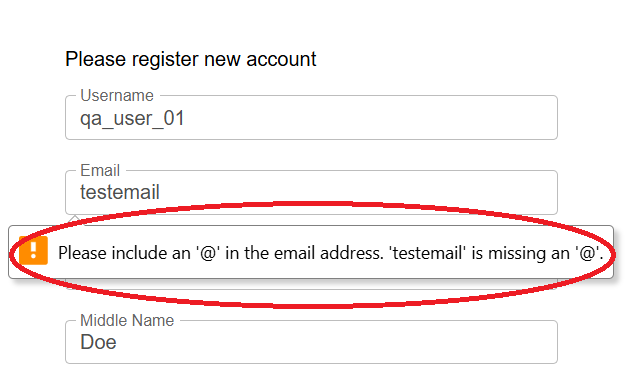
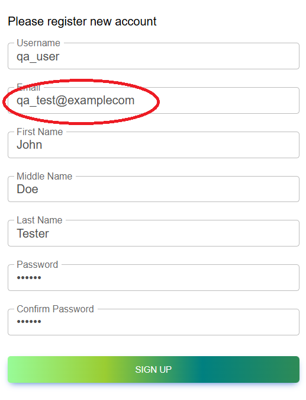
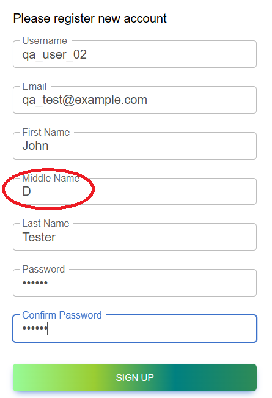
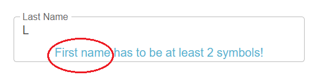

# Bugs Report – Home Page

This file works in parallel with [queries/queries.md](../queries/queries.md).
It documents all identified bugs related to the Home Page requirements and use cases.
Each bug is linked to its corresponding Jira issue, GitHub test case(s), and screenshot evidence.

---

## BUG-HP-01 – Missing picture in "Upload a Picture" section

**Jira Bug:** [SSQ-25](https://storyspoilerqa.atlassian.net/browse/SSQ-25)  
**Related Test Case:**  [TC-HP-01](../test-cases/test-cases-home-page.md#tc-hp-01--verify-home-page-for-non-logged-in-users) (Jira link: [SSQ-6](https://storyspoilerqa.atlassian.net/browse/SSQ-6))

### Steps to Reproduce
1. Open the app URL.
2. Scroll to the "Upload a Picture" section on the Home Page.

### Expected Result
The section should display:
- Motivational phrase
- Short description
- Corresponding picture

### Actual Result
The picture is not displayed. Instead, the alt text `"uploading spoiler story picture"` appears.

### Severity
Medium

### Priority
Medium

### Status
Open

### Affected Areas
Home Page (non-logged-in users)

### Screenshot

---

## BUG-HP-02 – Copyright link in footer does not redirect

**Jira Bug:** [SSQ-26](https://storyspoilerqa.atlassian.net/browse/SSQ-26)  
**Related Test Cases:**  
- [TC-HP-07](../test-cases/test-cases-home-page.md#tc-hp-07--verify-copyright-link-in-footer-for-non-logged-in-users) (Jira link: [SSQ-12](https://storyspoilerqa.atlassian.net/browse/SSQ-12)) – Verify Copyright link in footer for non-logged-in users
- [TC-HP-15](../test-cases/test-cases-home-page.md#tc-hp-15--verify-copyright-link-in-footer-for-logged-in-users) – (Jira link: [SSQ-15](https://storyspoilerqa.atlassian.net/browse/SSQ-20)) - Verify Copyright link in footer for logged-in users

### Steps to Reproduce
1. Open the app URL.
2. Scroll to the footer.
3. Click the "StorySpoil" copyright link.

### Expected Result
User is redirected to the dedicated Copyright page.

### Actual Result
The page does not redirect. Instead, the screen scrolls to the top.

### Severity
Medium 

### Priority
High  

### Status
Open  

### Affected Areas
- Home Page (non-logged-in users)  
- Home Page (logged-in users)  
- Any page containing the footer component  

---

## BUG-REG-01 – Validation error message does not specify the correct email address format

**Jira Bug:** [SSQ-56](https://storyspoilerqa.atlassian.net/browse/SSQ-56)  
**Related Test Cases:**  
- [TC-REG-08](../test-cases/test-cases-user-registration.md#tc-reg-08--verify-validation-for-invalid-email-missing-) (Jira link: [SSQ-41](https://storyspoilerqa.atlassian.net/browse/SSQ-41))
- [TC-REG-07](../test-cases/test-cases-user-registration.md#tc-reg-07--verify-validation-for-invalid-email-missing-) (Jira link: [SSQ-37](https://storyspoilerqa.atlassian.net/browse/SSQ-37))

### Steps to Reproduce
1. Open the app URL.
2. Click the “SIGN UP” button in the navigation bar.
3. Enter an invalid email address such as `testemail` in the Email field.
4. Fill in all other required fields with valid test data (see TD-07, TD-14, TD-28, TD-17, TD-20, TD-21).
5. Click the “SIGN UP” button.

### Expected Result
A clear validation error message is displayed that specifies the correct email format, including the presence of an `"@"` and a `"."`.

### Actual Result
The validation error message only mentions the `"@"` requirement but does not specify the missing `"."`.

### Severity
Medium

### Priority
High

### Status
Open

### Affected Area
Registration form – Email field

### Screenshot

---

## BUG-REG-02 – User is able to sign up with an invalid email address missing a "."

**Jira Bug:** [SSQ-57](https://storyspoilerqa.atlassian.net/browse/SSQ-57)  
**Related Test Case: ** [TC-REG-08](../test-cases/test-cases-user-registration.md#tc-reg-08--verify-validation-for-invalid-email-missing-) (Jira link: [SSQ-41](https://storyspoilerqa.atlassian.net/browse/SSQ-41))

### Steps to Reproduce
1. Open the app URL.
2. Click the “SIGN UP” button in the navigation bar.
3. Enter an invalid email address without a `"."`, e.g., `test@examplecom`.
4. Fill in all other required fields with valid test data (see TD-07, TD-14, TD-28, TD-17, TD-20, TD-21).
5. Click the “SIGN UP” button.

### Expected Result
The user should not be able to complete the sign-up process. A clear validation error message should be displayed indicating that the email format is invalid.

### Actual Result
The user is successfully registered with an invalid email address. No error message is displayed.

### Severity
High

### Priority
Critical

### Status
Open

### Affected Area
Registration form – Email validation

### Screenshots

---

## BUG-REG-03 – User can sign up with a middle name below the minimum boundary

**Jira Bug:** [SSQ-58](https://storyspoilerqa.atlassian.net/browse/SSQ-58)  
**Related Test Case: ** [TC-REG-13](../test-cases/test-cases-user-registration.md#tc-reg-13--verify-validation-for-invalid-middle-name-too-short) (Jira link: [SSQ-46](https://storyspoilerqa.atlassian.net/browse/SSQ-46))

### Steps to Reproduce
1. Open the app URL.
2. Click the “SIGN UP” button in the navigation bar.
3. Enter a middle name of 1 character, such as `A`, in the Middle Name field.
4. Fill in all other required fields with valid test data (see TD-07, TD-09, TD-14, TD-17, TD-21).
5. Click the “SIGN UP” button.

### Expected Result
The user should not be able to create an account with a middle name shorter than 2 characters. A clear validation error message should be displayed indicating that the middle name must be between 2–60 characters.

### Actual Result
The user is able to create an account with a 1-character middle name. No error message is displayed.

### Severity
Low

### Priority
Medium

### Status
Open

### Affected Area
Registration form – Middle Name field

### Screenshots

---

## BUG-REG-04 – Incorrect field reference in Last Name validation

**Jira Bug:** [SSQ-70](https://storyspoilerqa.atlassian.net/browse/SSQ-70)  
**Related Test Case: ** [TC-REG-15](../test-cases/test-cases-user-registration.md#tc-reg-15--verify-validation-for-invalid-last-name-too-short) (Jira link: [SSQ-48](https://storyspoilerqa.atlassian.net/browse/SSQ-48))

### Steps to Reproduce
1. Open the app URL.
2. Click the “SIGN UP” button in the navigation bar.
3. Enter a last name of 1 character, such as `L`, in the Last Name field.
4. Fill in all other required fields with valid test data (see TD-07, TD-09, TD-14, TD-20, TD-21).
5. Click the “SIGN UP” button.

### Expected Result
A clear validation error message should be displayed indicating that the last name must be at least 2 characters.

### Actual Result
An error message appears under the Last Name field: `"Last name has to be at least 2 symbols!"`.

### Severity
Medium

### Priority
High

### Status
Open

### Affected Area
Registration form – Last Name field validation

### Screenshot

---