# Queries – Home Page

This document lists all open queries identified during requirements, use case and test case analysis. The issues are not strictly functional bugs but require clarification and alignment with stakeholders.
This file works in parallel with [bugs/bug-report.md](../queries/bug-report.md).
Each query has a unique ID (QRY-XX-XX), is linked to its corresponding Jira issue, GitHub test case(s), and screenshot evidence.
Screenshots are stored in the `docs/screenshots/` folder. All usernames, emails, and other data displayed in screenshots are dummy test data used solely for QA purposes.

> ⚠️ Note: Screenshots or excerpts from the original requirements document are omitted due to copyright restrictions. Related issues are described textually without reproducing protected material.

---

## QRY-HP-01 – Requirements for Home Page for logged in users lack visuals and detailed content specification

**Jira query:** [SSQ-27](https://storyspoilerqa.atlassian.net/browse/SSQ-27)  
**Related Test Case:** [TC-HP-08](../test-cases/test-cases-home-page.md#tc-hp-08--verify-home-page-for-logged-in-users) (Jira: [SSQ-13](https://storyspoilerqa.atlassian.net/browse/SSQ-13))

**Description:**
The original requirement document for the **Home Page (Logged-in User)** is incomplete. It lacks visuals and detailed text specification. Without them, developers and testers cannot reliably build or validate the feature.

**Steps to Identify:**

1. Open the oiginal requirement document.
2. Navigate to the section "Home Page (Logged-in User)".

**Expected:**
The requirement should contain a clear visual alongside a detailed description of:

* Page title and welcome message
* Content and layout of the body
* Labels/icons for navigation (Home, Profile, etc.)

**Actual:**

* No visuals provided
* Text description is incomplete and ambiguous

**Status:** Open

---

## QRY-HP-02 – Home Page for logged-in users navigation link label

**Jira Query:** [SSQ-28](https://storyspoilerqa.atlassian.net/browse/SSQ-28)  
**Related Test Case:** [TC-HP-11](../test-cases/test-cases-home-page.md#tc-hp-11--verify-storyspoil-home-link-for-logged-in-users) (Jira: [SSQ-16](https://storyspoilerqa.atlassian.net/browse/SSQ-16))

**Description:**
Original requirement document states the navigation bar should display "**StorySpoil**" (mixed case), but both the mockup and current implementation show "**STORYSPOIL**" (all caps).

**Steps to Identify:**

1. Open the original requirement document.
2. Compare with the attached mockup.
3. Verify the implemented navigation bar in the app.

**Expected:**
Text formatting should be consistent between requirement, design mockup, and implementation.

**Actual:**
Requirement text differs from both design and implementation.

**Status:** Open

---

## QRY-REG-01 – Consistency of capitalization in field names

* **Jira Query:** [SSQ-59](https://storyspoilerqa.atlassian.net/browse/SSQ-59) 
* **Related Test Cases:** 
- [TC-REG-20](../test-cases/test-cases-user-registration.md#tc-reg-20--verify-validation-for-existing-username-reuse) (Jira: [SSQ-53](https://storyspoilerqa.atlassian.net/browse/SSQ-53))
- [TC-REG-04](../test-cases/test-cases-user-registration.md#tc-reg-04--verify-validation-for-all-required-fields) (Jira: [SSQ-40](https://storyspoilerqa.atlassian.net/browse/SSQ-40))

**Description:**
Error messages use inconsistent capitalization for field names (e.g., `"UserName already taken!"` vs. `"User name is required!"`).

**Steps to Identify:**

1. Open the app URL.
2. Navigate to Sign Up page.
3. In the Username field, enter duplicate (TD-02) or invalid (empty) usernames to trigger different validation messages.

**Expected Result:**
Error messages should follow a consistent capitalization style (e.g., "Username").

**Actual Result:**
Field names are inconsistently capitalized across error messages.

### Screenshots
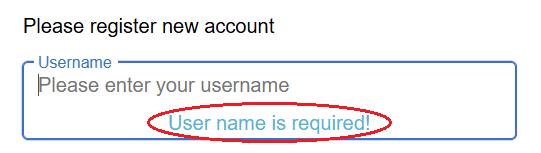  
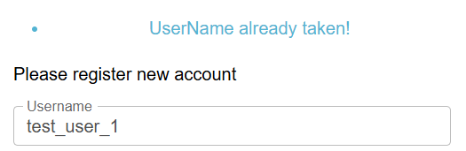  

**Status:** Open

---

## QRY-REG-02 – Consistency of required field messages

* **Jira Query:** [SSQ-63](https://storyspoilerqa.atlassian.net/browse/SSQ-63) 
* **Related Test Case:** [TC-REG-04](../test-cases/test-cases-user-registration.md#tc-reg-04--verify-validation-for-all-required-fields) (Jira: [SSQ-53](https://storyspoilerqa.atlassian.net/browse/SSQ-53))

**Description:**
Required field messages are inconsistent:

* `"User name is required!"`
* `"The e-mail is required!"`
* `"First name is required!"`
* `"The password is required!"`

**Steps to Identify:**
Trigger required field validation across different fields.

**Expected Result:**
Required messages should follow a consistent format (e.g., `"<Field> is required!"`).

**Actual Result:**
Some messages start with "The", others don’t.

### Screenshot
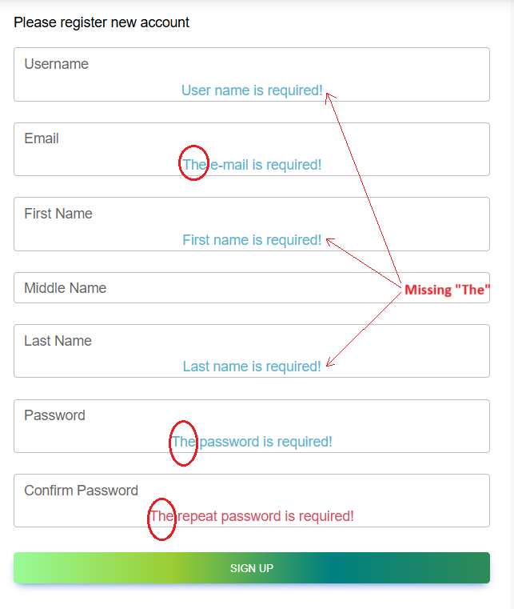

**Status:** Open

---

## QRY-REG-03 – Validation messages tone and punctuation consistency

* **Jira Query:** [SSQ-64](https://storyspoilerqa.atlassian.net/browse/SSQ-64) 
* **Related Test Cases:** 
- [TC-REG-17](../test-cases/test-cases-user-registration.md#tc-reg-17--verify-validation-for-invalid-password-too-short) (Jira: [SSQ-50](https://storyspoilerqa.atlassian.net/browse/SSQ-50))
- [TC-REG-19](../test-cases/test-cases-user-registration.md#tc-reg-19--verify-validation-for-invalid-repeat-password-mismatched) (Jira: [SSQ-52](https://storyspoilerqa.atlassian.net/browse/SSQ-52))

**Description:**
Inconsistent punctuation:

* `"Password has to be at least 6 symbols!"` (exclamation mark).
* `"Passwords don't match."` (period).

**Steps to Identify:**
1. Open the app URL.
2. Navigate to Sign Up page.
3. In the Password field, enter very short password (TD-22), or in the Confirm Password field, enter incorrect repeat password (TD-24) to trigger validation messages.

**Expected Result:**
All error messages should use consistent punctuation.

**Actual Result:**
Error messages mix exclamation marks and periods.

### Screenshots
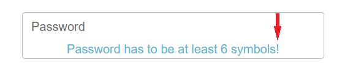  
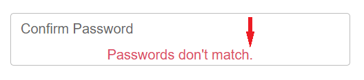  

**Status:** Open

---

## QRY-REG-04 – Label discrepancy for "Repeat Password" vs. "Confirm Password"

* **Jira Query:** [SSQ-65](https://storyspoilerqa.atlassian.net/browse/SSQ-65) 
* **Related Test Case:** [TC-REG-01](../test-cases/test-cases-user-registration.md#tc-reg-01--verify-sign-up-page) (Jira: [SSQ-34](https://storyspoilerqa.atlassian.net/browse/SSQ-34))

**Description:**
In the original requirements document, the field label is described as "Repeat password", but the image shows "Confirm password". The application also uses "Confirm password".

**Steps to Identify:**

1. Open the original requirements document.
2. Navigate to the section Sign Up Page.
3. Compare the field label in the text vs. the image and application.

**Expected Result:**
There should be no inconsistency between requirement description, UI design, and app implementation.

**Actual Result:**
Requirements specify "Repeat password", but design and app show "Confirm password".

**Status:** Open

---

## QRY-REG-05 – Required field indicators not defined in requirements

* **Jira Query:** [SSQ-66](https://storyspoilerqa.atlassian.net/browse/SSQ-66) 
* **Related Test Case:** [TC-REG-04](../test-cases/test-cases-user-registration.md#tc-reg-04--verify-validation-for-all-required-fields) (Jira: [SSQ-40](https://storyspoilerqa.atlassian.net/browse/SSQ-40))

**Description:**
It is not mentioned in the original requirements document whether required fields should be visually marked. The app currently does not display required field indicators (e.g., red asterisk).

**Steps to Identify:**

1. Open the requirements document.
2. Navigate to Sign Up Page.
3. Compare field specifications with actual UI.

**Expected Result:**
Requirements should specify if required fields must be visually indicated.

**Actual Result:**
No indicators are defined or displayed.

**Status:** Open

---

## QRY-REG-06 – Missing character type constraints for all input fields

* **Jira Query:** [SSQ-68](https://storyspoilerqa.atlassian.net/browse/SSQ-68) 
* **Related Test Cases:** 
- [TC-REG-02](../test-cases/test-cases-user-registration.md#tc-reg-02--verify-registration-with-valid-data-without-optional-middle-name) (Jira: [SSQ-35](https://storyspoilerqa.atlassian.net/browse/SSQ-35))
- [TC-REG-03](../test-cases/test-cases-user-registration.md#tc-reg-03--verify-registration-with-valid-data-with-optional-middle-name) (Jira: [SSQ-39](https://storyspoilerqa.atlassian.net/browse/SSQ-39))

**Description:**
The original requirements document defines only the minimum and maximum character lengths for each registration field but does not specify permitted or prohibited character types (e.g., special characters, digits, spaces, symbols).

**Steps to Identify:**

1. Review the original requirements document section "Sign Up Page".
2. Observe that no field-level constraints are mentioned for character types.
3. Compare with actual app behavior (fields accept a wide range of symbols and special characters).

**Expected Result:**
The requirements should specify which character types are allowed or disallowed for each field (e.g., only letters for names, alphanumeric for usernames, etc.).

**Actual Result:**
Only field length constraints are defined; no character-type restrictions are mentioned.

**Status:** Open

---

## QRY-REG-07 – Missing user agreement or terms acceptance step

* **Jira Query:** [SSQ-69](https://storyspoilerqa.atlassian.net/browse/SSQ-69) 
* **Related Test Case:** [TC-REG-01](../test-cases/test-cases-user-registration.md#tc-reg-01--verify-sign-up-page) (Jira: [SSQ-34](https://storyspoilerqa.atlassian.net/browse/SSQ-34))

**Description:**
The Sign Up form does not include an option for users to agree to Terms and Conditions or Privacy Policy, nor is this requirement defined in the original requirements document.

**Steps to Identify:**

1. Open the app URL.
2. Navigate to Sign Up Page.
3. Observe that the registration form contains no checkbox or link for legal agreements.
4. Review the original requirements document "Sign Up Page" section for confirmation.

**Expected Result:**
Requirements and UI should include a step for users to explicitly agree to Terms of Service or Privacy Policy before account creation.

**Actual Result:**
No such checkbox or acceptance step exists in the current implementation or in the documented requirements.

**Status:** Open

---

## QRY-LOG-01 – Consistency of required field messages

* **Jira Query:** [SSQ-85](https://storyspoilerqa.atlassian.net/browse/SSQ-85)
* **Related Test Case:** [TC-LOG-03](../test-cases/test-cases-log-in-page.md#tc-log-03--verify-validation-for-required-fields) (Jira: [SSQ-79](https://storyspoilerqa.atlassian.net/browse/SSQ-79))

**Description:**
Required field messages are inconsistent:

* `"Username is required!"`
* `"The password is required!"`

**Steps to Identify:**
1. Open the app URL.
2. Navigate to Log In page.
3. Leave the Username and Password fields empty (TD-31).
4. Click "LOG IN" button.

**Expected Result:**
Required messages should follow a consistent format (e.g., `"<Field> is required!"`).

**Actual Result:**
One message starts with "The", the other doesn’t.

### Screenshot

---

## QRY-LOG-02 – Generic error message for invalid login credentials

* **Jira Query:** [SSQ-86](https://storyspoilerqa.atlassian.net/browse/SSQ-86) 
* **Related Test Cases:** 
- [TC-LOG-04](../test-cases/test-cases-log-in-page.md#tc-log-04--verify-validation-for-invalid-username) (Jira: [SSQ-80](https://storyspoilerqa.atlassian.net/browse/SSQ-80))
- [TC-LOG-05](../test-cases/test-cases-log-in-page.md#tc-log-05--verify-validation-for-invalid-password) (Jira: [SSQ-81](https://storyspoilerqa.atlassian.net/browse/SSQ-81))

**Description:**
When attempting to log in with an invalid username or incorrect password, the system displays a generic error message `"Unable to sign in!"`.

**Steps to Identify:**

1. Open the app URL.
2. Navigate to Log In page.
3. Enter invalid username (TD-04) and valid password (TD-04) or valid username (TD-30) and incorrect password (TD-30) in the Password field.
4. Click "LOG IN" button.

**Expected Result:**
System should display more specific validation message (e.g., `"Invalid username/password"`).

**Actual Result:**
The error message is generic. No clarification is provided on whether the issue is with the username or the password.  

### Screenshots
  
  

---

## QRY-PROF-01 – Inconsistent field labels between text and mockup in the requirements document

* **Jira Query:** [SSQ-62](https://storyspoilerqa.atlassian.net/browse/SSQ-62)  
* **Related Test Case:** [TC-PROF-04](../test-cases/test-cases-log-in-page.md#tc-prof-04--verify-edit-profile-info-page) (Jira: [SSQ-101](https://storyspoilerqa.atlassian.net/browse/SSQ-101))

**Description:**  
There is an inconsistency between the text description and the mockup image in the original requirements docuement for the Edit Profile Info page field labels.  
- The text lists the following fields: `First Name`, `Middle Name`, `Last Name`, `About me`, `Profile picture`.
- The mokup image displays different labels: `First Name`, `Mid Name`, `Last Name`, `About`, `Picture URL`.

This mismatch causes ambiguity in naming conventions and expected field labels for the Edit Profile Info page.

**Steps to Identify:**  
1. Open the original requirements document.
2. Navigate to the section Edit Profile Info Page.  
3. Compare the field names listed in the text description with those shown in the accompanying mockup image. 

**Expected Result:**  
Field labels should be consistent across the original requirements docuement text and mockup image to ensure clarity and accurate test design.  

**Actual Result:**  
Field labels differ between the text and mockup image.  

**Status:** Open  

---

## QRY-CRSP-01 – Missing "SHARE" button on newly created spoilers

* **Jira Query:** [SSQ-67](https://storyspoilerqa.atlassian.net/browse/SSQ-67)  
* **Related Test Cases:** 
- [TC-CRSP-02](../test-cases/test-cases-spoiler-creation.md#tc-crsp-02--verify-spoiler-creation-with-all-valid-fields) (Jira: [SSQ-119](https://storyspoilerqa.atlassian.net/browse/SSQ-119))

**Description:**  
According to the original requirements document, the newly created spoiler should display "SHARE", "EDIT", and "DELETE" buttons on the Home page after creation. However, the current implementations show only "EDIT" and "DELETE" buttons.

**Steps to Identify:**  
1. Open the app URL.
2. Navigate to the Create Spoiler page.
4. In the Story title field, enter TD-40 (valid story title).
6. In the Describe your story spoiler field, enter TD-41 (valid story description).
7. In the Add a picture for the spoiler field, enter TD-33 (valid picture URL) or leave the field empty.
8. Click “CREATE” button.

**Expected Result:**  
All three buttons ("SHARE", "EDIT", "DELETE") should be displayed as described in the requirement.

**Actual Result:**  
The "SHARE" button is missing. 

**Status:** Open  

**Screenshot:**
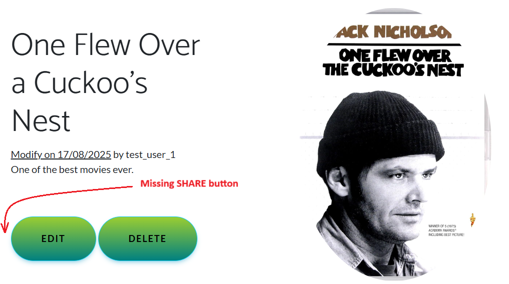

---

## QRY-CRSP-02 – Generic and improperly formatted validation message for invalid picture URL

* **Jira Query:** [SSQ-94](https://storyspoilerqa.atlassian.net/browse/SSQ-94)
* **Related Test Cases:**
- [TC-CRSP-07](../test-cases/test-cases-spoiler-creation.md#tc-crsp-07--verify-validation-for-spoiler-picture-field-with-invalid-url-missing-protocol) (Jira: [SSQ-124](https://storyspoilerqa.atlassian.net/browse/SSQ-124))
- [TC-CRSP-08](../test-cases/test-cases-spoiler-creation.md#tc-crsp-08--verify-validation-for-spoiler-picture-field-with-invalid-url-missing-file-extension) (Jira: [SSQ-125](https://storyspoilerqa.atlassian.net/browse/SSQ-125))
- [TC-CRSP-09](../test-cases/test-cases-spoiler-creation.md#tc-crsp-09--verify-validation-for-spoiler-picture-field-with-invalid-url-wrong-extension) (Jira: [SSQ-126](https://storyspoilerqa.atlassian.net/browse/SSQ-126))
- [TC-CRSP-10](../test-cases/test-cases-spoiler-creation.md#tc-crsp-10--verify-validation-for-spoiler-picture-field-with-invalid-url-invalid-url-structure) (Jira: [SSQ-127](https://storyspoilerqa.atlassian.net/browse/SSQ-127))

**Description:**  
When entering an invalid Picture URL in the Create Spoiler form, the system displays a generic error message `"Invalid url!"` regardless of the specific issue (invalid structure, missing protocol, missing or wrong file extension).  
Additionally, the message text is not properly formatted — the word “url” is lowercase and an exclamation mark is used.

**Steps to Identify:**

1. Open the app URL.  
2. Navigate to Create Spoiler page.  
4. In the Story title field, enter TD-40 (valid story title).
6. In the Describe your story spoiler field, enter TD-41 (valid story description).  
5. In the Add a picture for the spoiler field, enter one of the following invalid values:
   - Missing protocol: TD-35
   - Missing file extension: TD-36
   - Wrong file extension: TD-37
   - Invalid URL structure: TD-34
6. Click "CREATE" button.

**Expected Result:**  
A clear and properly formatted validation message should be displayed, specific to the type of input error.  
Example messages:
- “Please enter a valid URL starting with http:// or https://.”
- “Image URL must point to a supported image file (.jpg, .png, .jpeg, .gif).”
- “Please enter a valid image URL.”

**Actual Result:**  
A generic and inconsistently formatted message `"Invalid url!"` appears for all invalid URL scenarios.

### Screenshots
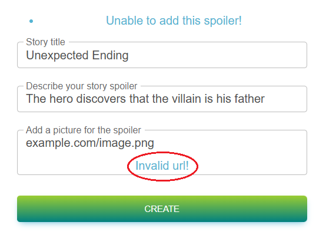  
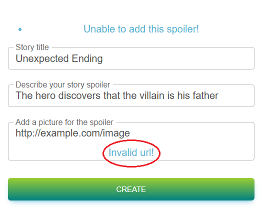  
  
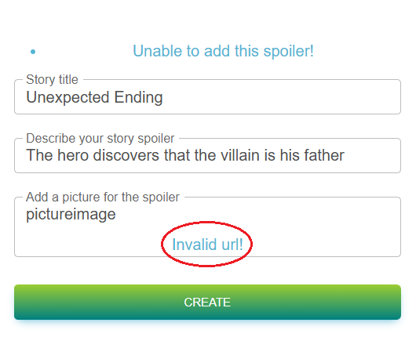  

---

## QRY-SM-01 – Incorrect capitalization in placeholder text in Share Spoiler page mockup

* **Jira Query:** [SSQ-84](https://storyspoilerqa.atlassian.net/browse/SSQ-84)  
* **Related Test Case:** 
- [TC-SM-04](../test-cases/test-cases-spoiler-management.md#tc-sm-04--verify-share-spoiler-pages) (Jira: [SSQ-141](https://storyspoilerqa.atlassian.net/browse/SSQ-141))

**Description:**  
In the mockup image for the Share Spoiler page (included in the original requirements document), the Name input field shows the placeholder text `Add The name of your friend`. The word "The" appears incorrectly capitalized. It is unclear whether this capitalization error exists in the implemented UI or only in the mockup.  
Clarification is needed to ensure text consistency and correct placeholder formatting.

**Steps to Identify:**  
1. Open the original requirements document.
2. Navigate to the section Story Spoiler Management. 
3. Locate the mockup for the Share Spoiler page.  
4. Observe the placeholder text in the Name field.

**Expected Result:**  
The placeholder should follow standard capitalization rules and read `Add the name of your friend`.

**Actual Result:**  
The placeholder text in the mockup reads `Add The name of your friend`.

**Status:** Open  

---

## QRY-SM-02 – Missing field validation rules and required field specifications on Share Spoiler page

* **Jira Query:** [SSQ-171](https://storyspoilerqa.atlassian.net/browse/SSQ-171)  
* **Related Test Cases:** 
- [TC-SM-05](../test-cases/test-cases-spoiler-management.md#tc-sm-05--verify-spoiler-sharing-with-valid-data) (Jira: [SSQ-142](https://storyspoilerqa.atlassian.net/browse/SSQ-142))
- [TC-SM-06](../test-cases/test-cases-spoiler-management.md#tc-sm-06--verify-maximum-length-validation-for-message) (Jira link: [SSQ-168](https://storyspoilerqa.atlassian.net/browse/SSQ-168))
- [TC-SM-07](../test-cases/test-cases-spoiler-management.md#tc-sm-07--verify-maximum-length-validation-for-name) (Jira link: [SSQ-169](https://storyspoilerqa.atlassian.net/browse/SSQ-169))
- [TC-SM-08](../test-cases/test-cases-spoiler-management.md#tc-sm-08--verify-validation-for-invalid-email-missing-e) (Jira link: [SSQ-143](https://storyspoilerqa.atlassian.net/browse/SSQ-143))
- [TC-SM-09](../test-cases/test-cases-spoiler-management.md#tc-sm-09--verify-validation-for-invalid-email-missing-) (Jira link: [SSQ-144](https://storyspoilerqa.atlassian.net/browse/SSQ-144))
- [TC-SM-10](../test-cases/test-cases-spoiler-management.md#tc-sm-10--verify-validation-for-invalid-email-missing--and-) (Jira link: [SSQ-145](https://storyspoilerqa.atlassian.net/browse/SSQ-145))
- [TC-SM-11](../test-cases/test-cases-spoiler-management.md#tc-sm-11--verify-validation-for-invalid-email-extra-spaces) (Jira link: [SSQ-146](https://storyspoilerqa.atlassian.net/browse/SSQ-146))
- [TC-SM-12](../test-cases/test-cases-spoiler-management.md#tc-sm-12--verify-validation-for-empty-email-field) (Jira link: [SSQ-147](https://storyspoilerqa.atlassian.net/browse/SSQ-147))
- [TC-SM-13](../test-cases/test-cases-spoiler-management.md#tc-sm-13--verify-validation-for-invalid-email-missing-username) (Jira link: [SSQ-148](https://storyspoilerqa.atlassian.net/browse/SSQ-148))
- [TC-SM-14](../test-cases/test-cases-spoiler-management.md#tc-sm-14--verify-validation-for-invalid-email-missing-domain-name) (Jira link: [SSQ-149](https://storyspoilerqa.atlassian.net/browse/SSQ-149))
- [TC-SM-15](../test-cases/test-cases-spoiler-management.md#tc-sm-15--verify-validation-for-invalid-email-missing-host) (Jira link: [SSQ-150](https://storyspoilerqa.atlassian.net/browse/SSQ-150))
- [TC-SM-16](../test-cases/test-cases-spoiler-management.md#tc-sm-16--verify-validation-for-invalid-email-multiple--symbols) (Jira link: [SSQ-151](https://storyspoilerqa.atlassian.net/browse/SSQ-151))

**Description:**  
The original requirements document does not define any input validation rules, formatting constraints, or required field specifications for the Share Spoiler page.  
It is unclear:  
- Which fields are mandatory (e.g., Friend’s Name, Message, or other optional fields).  
- What input formats or character limitations apply.  
- Whether the Name field should allow only letters or certain special characters.  
- If the Message field has a maximum character length or formatting restrictions.  

Because the Share Spoiler page is currently inaccessible (see related bug [BUG-SM-01](../bugs/bug-sm-01-missing-share-button.md)), it is not possible to verify these behaviors in the implementation.

Clarification is needed to define:
- Required versus optional fields.  
- Formatting and validation rules for each field.  
- Expected system response and error handling behavior when validation fails.

**Steps to Identify:**  
1. Open the original requirements document.
2. Navigate to the section Story Spoiler Management. 
3. Note that it lacks any textual description of field rules or input constraints for the Share Spoiler page.  
4. Review the mockup — it provides no visible hints about required fields or validation messages.  
5. Testing of this functionality is currently blocked due to the Share Spoiler page being inaccessible.

**Expected Result:**  
The original requirements document should specify for each field:  
- Whether it is required or optional.  
- Allowed character types, limits, and formats.  
- Validation rules for the Name and Message fields.  
- Expected system response for invalid input (error messages, highlights, or disabling of the “Share” button).

**Actual Result:**  
- No validation, formatting, or required field specifications are defined in the original requirements document.  
- Mockup provides no indication of constraints or validation behavior.  
- Functional verification is currently blocked due to the related accessibility issue.

**Status:** Open

---

## QRY-SM-03 – Missing specification and unclear labeling behavior on Edit Spoiler page

* **Jira Query:** [SSQ-172](https://storyspoilerqa.atlassian.net/browse/SSQ-172)  
* **Related Test Case:** [TC-SM-17](../test-cases/test-cases-spoiler-management.md#tc-sm-17--verify-edit-spoiler-page) (Jira: [SSQ-152](https://storyspoilerqa.atlassian.net/browse/SSQ-152))

**Description:**  
The original requirements document does not include a textual description of the Edit Spoiler page. The mockup image also shows three input fields without any visible labels or placeholder text, making it unclear how these fields should be identified.

In the implemented app:  
- The first field appears to correspond to the spoiler title.  
- The second field appears to be for the spoiler description.  
- The third field appears to be the spoiler picture URL.
- The page displays dynamic field labels that change based on the current spoiler values.  
- For example, if a spoiler’s title is “The Hidden Ending,” the label of the first field becomes “The Hidden Ending” instead of “Title.”  
- This behavior applies similarly to the description and picture URL fields.

This makes it unclear for the user whether the text shown is the field label or the editable content, creating confusion and potential usability issues.

Clarification is needed regarding:
- Whether static labels (e.g., “Title”, “Description”, “Picture URL”) should appear next to or above the fields.  
- Whether the existing spoiler content should populate the input fields as values rather than dynamic labels.  
- What the intended UI layout and labeling behavior should be according to design standards.

**Steps to Identify:**  
1. Open the original requirements document.
2. Navigate to the section Story Spoiler Management. 
3. Check the corresponding mockup for the Edit Spoiler page — it shows three unlabeled input fields.
4. Observe that there is no text description or label specification.
5. Open the app and attempt to edit an existing spoiler.  
6. Observe that the labels dynamically display the current spoiler values.

**Expected Result:**  
The original requirements document should clearly specify:
- Static and descriptive field labels (e.g., “Title”, “Description”, “Picture”).  
- The intended display of current spoiler data (as field values, not labels).  
- Proper visual differentiation between labels and editable content.

**Actual Result:**  
No text or label specifications in the original requirements document.  
- Mockup lacks labeling guidance.  
- App uses dynamic labels showing spoiler content instead of fixed field labels.

**Status:** Open  

---

## QRY-SM-04 – Incorrect button label "CREATE" on Edit Spoiler page

* **Jira Query:** [SSQ-173](https://storyspoilerqa.atlassian.net/browse/SSQ-173)  
* **Related Test Case:** [TC-SM-17](../test-cases/test-cases-spoiler-management.md#tc-sm-17--verify-edit-spoiler-page) (Jira: [SSQ-152](https://storyspoilerqa.atlassian.net/browse/SSQ-152))

**Description:**  
On the Edit Spoiler page, the button used to confirm and save changes is labeled "CREATE".  
This label is inconsistent with the page’s intended functionality and may confuse users, as "CREATE" typically refers to adding a new spoiler rather than updating an existing one.

The mockup for the Edit Spoiler page in the original requirements document also shows the "CREATE" button.

**Steps to Identify:**  
1. Open the original requirements document.
2. Navigate to the section Story Spoiler Management. 
3. Check the corresponding mockup for the Edit Spoiler page — it shows the "CREATE" button.
4. Open the app and attempt to edit an existing spoiler.  
5. Observe the button for saving the changes.

**Expected Result:**  
The button on the Edit Spoiler page should use a clear and context-appropriate label such as "UPDATE" or "SAVE", indicating that it will modify an existing spoiler.

**Actual Result:**  
The button label reads "CREATE", which implies creation of a new spoiler instead of editing an existing one.

**Status:** Open  

**Screenshot**
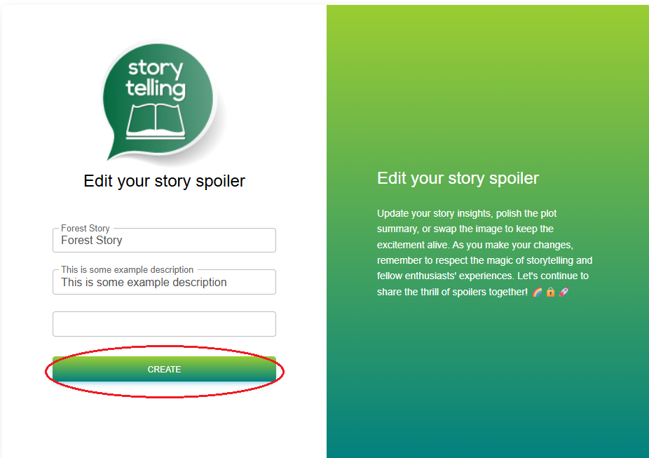

---

## QRY-SM-05 – Missing field validation rules and required field specifications on Edit Spoiler page

* **Jira Query:** [SSQ-174](https://storyspoilerqa.atlassian.net/browse/SSQ-174)  
* **Related Test Case:** 
- [TC-SM-18](../test-cases/test-cases-spoiler-management.md#tc-sm-18--verify-spoiler-edit-with-all-valid-fields) (Jira: [SSQ-159](https://storyspoilerqa.atlassian.net/browse/SSQ-159))
- [TC-SM-19](../test-cases/test-cases-spoiler-management.md#tc-sm-19--verify-spoiler-edit-with-only-required-fieldss) (Jira: [SSQ-160](https://storyspoilerqa.atlassian.net/browse/SSQ-160))
- [TC-SM-20](../test-cases/test-cases-spoiler-management.md#tc-sm-20--verify-required-fields-validation-when-all-fields-are-empty) (Jira: [SSQ-161](https://storyspoilerqa.atlassian.net/browse/SSQ-161))
- [TC-SM-21](../test-cases/test-cases-spoiler-management.md#tc-sm-21--verify-maximum-length-validation-for-spoiler-title) (Jira: [SSQ-162](https://storyspoilerqa.atlassian.net/browse/SSQ-162))
- [TC-SM-22](../test-cases/test-cases-spoiler-management.md#tc-sm-22--verify-maximum-length-validation-for-spoiler-description) (Jira: [SSQ-163](https://storyspoilerqa.atlassian.net/browse/SSQ-163))
- [TC-SM-23](../test-cases/test-cases-spoiler-management.md#tc-sm-23--verify-validation-for-spoiler-picture-field-with-invalid-url-missing-protocol) (Jira: [SSQ-164](https://storyspoilerqa.atlassian.net/browse/SSQ-164))
- [TC-SM-24](../test-cases/test-cases-spoiler-management.md#tc-sm-24--verify-validation-for-spoiler-picture-field-with-invalid-url-missing-file-extension) (Jira: [SSQ-165](https://storyspoilerqa.atlassian.net/browse/SSQ-165))
- [TC-SM-25](../test-cases/test-cases-spoiler-management.md#tc-sm-25--verify-validation-for-spoiler-picture-field-with-invalid-url-wrong-extension) (Jira: [SSQ-166](https://storyspoilerqa.atlassian.net/browse/SSQ-166))
- [TC-SM-26](../test-cases/test-cases-spoiler-management.md#tc-sm-26--verify-validation-for-spoiler-picture-field-with-invalid-url-invalid-url-structure) (Jira: [SSQ-167](https://storyspoilerqa.atlassian.net/browse/SSQ-167))

**Description:**  
The original requirements document does not define any input validation rules, formatting constraints, or required field specifications for the Edit Spoiler page.  
It is unclear:  
- Which fields are mandatory (Title, Description, Picture URL).  
- What input formats and character types are allowed.  
- Whether maximum or minimum character lengths are enforced.  
- Whether the Picture URL field should be validated for correct URL format or image extensions.

The absence of this information prevents testers from creating accurate test cases for both:
- Happy path scenarios (valid input).  
- Validation error handling (invalid, missing, or improperly formatted input).

Clarification is needed to define:
- Required versus optional fields.  
- Input format and validation rules for each field.  
- Expected system behavior when validation fails (error messages, field highlights, etc.).

**Steps to Identify:**  
1. Open the original requirements document.
2. Navigate to the section Story Spoiler Management. 
3. Observe that no text description or validation section is included for the Edit Spoiler page.  
4. Attempt to edit a spoiler in the app and test various inputs (e.g., empty title, invalid URL).  
5. Note that system behavior and field validation are inconsistent or undefined.

**Expected Result:**  
The original requirements document should specify for each field:
- Whether it is required or optional.  
- Allowed character types and limits.  
- Specific format constraints (e.g., valid URL for picture field).
- Expected system behavior and user feedback for invalid input.

**Actual Result:**  
- No validation or formatting rules are defined in the original requirements document.  
- Required fields are not identified.  
- Validation behavior is unclear or inconsistent in the implementation.

**Status:** Open

---

## QRY-SM-06 – Missing confirmation prompt or message for spoiler deletion

* **Jira Query:** [SSQ-175](https://storyspoilerqa.atlassian.net/browse/SSQ-175)  
* **Related Test Case:** 
- [TC-SM-27](../test-cases/test-cases-spoiler-management.md#tc-sm-27--verify-spoiler-deletion) (Jira: [SSQ-153](https://storyspoilerqa.atlassian.net/browse/SSQ-153))

**Description:**  
When a user deletes a spoiler, the deletion occurs immediately and irreversibly, without any confirmation prompt or success message.  

The original requirements document does not specify whether the system should display:  
- A confirmation dialog before deletion (e.g., “Are you sure you want to delete this spoiler?”), or  
- A notification or success message after successful deletion.  

This omission creates ambiguity about expected behavior and increases the risk of accidental data loss.  

Clarification is needed to determine:  
- Whether a confirmation step is required before deletion.  
- Whether a success or feedback message should appear after deletion.  
- If undo or recovery options should be supported.

**Steps to Identify:**  
1. Open the original requirements document.
2. Navigate to the section Story Spoiler Management. 
2. Observe that no mention is made of confirmation prompts or success notifications for the Delete Spoiler page.  
3. Execute the delete action for a spoiler in the app.  
4. Note that the spoiler is deleted immediately without any user confirmation or visible feedback.

**Expected Result:**  
The original requirements document should specify:  
- Whether the system must ask for user confirmation before deleting a spoiler.  
- What type of user feedback should appear after deletion (confirmation dialog, toast message, etc.).  
- Whether deleted spoilers can be restored or if the action is permanent.

**Actual Result:**  
- The original requirements document provides no guidance on confirmation or feedback behavior.  
- The app deletes spoilers immediately without any prompt or notification.  
- This behavior may lead to accidental data loss and user confusion.

**Status:** Open

**Screenshots:**
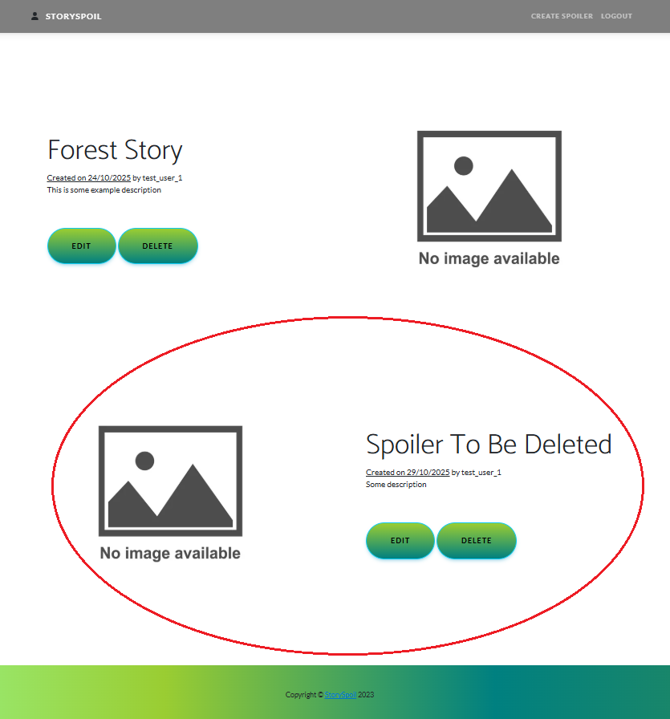
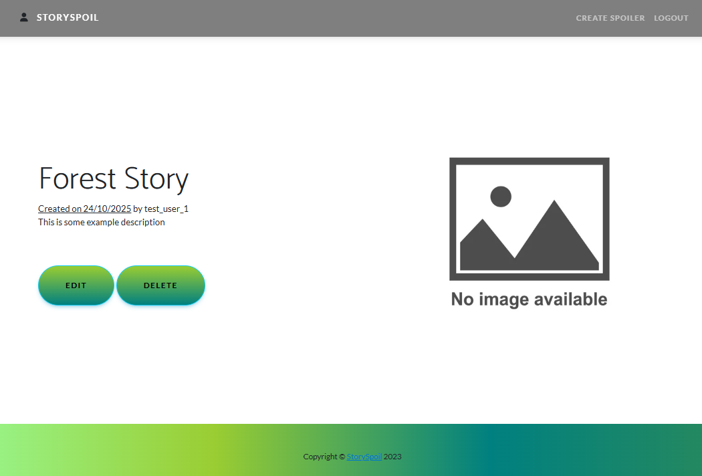

---

## QRY-UX-01 – Extra bullet point before error messages across multiple forms

**Jira Query:** [SSQ-60](https://storyspoilerqa.atlassian.net/browse/SSQ-60)

**Related Test Cases:**  
- [TC-REG-20](../test-cases/test-cases-user-registration.md#tc-reg-20--verify-validation-for-existing-username-reuse) (Jira: [SSQ-53](https://storyspoilerqa.atlassian.net/browse/SSQ-53))
- [TC-REG-21](../test-cases/test-cases-user-registration.md#tc-reg-21--verify-validation-for-existing-email-reuse) (Jira: [SSQ-54](https://storyspoilerqa.atlassian.net/browse/SSQ-54))
- [TC-LOG-03](../test-cases/test-cases-log-in-page.md#tc-log-03--verify-validation-for-required-fields) (Jira: [SSQ-79](https://storyspoilerqa.atlassian.net/browse/SSQ-79))
- [TC-LOG-04](../test-cases/test-cases-log-in-page.md#tc-log-04--verify-validation-for-invalid-username) (Jira: [SSQ-80](https://storyspoilerqa.atlassian.net/browse/SSQ-80))
- [TC-LOG-05](../test-cases/test-cases-log-in-page.md#tc-log-05--verify-validation-for-invalid-password) (Jira: [SSQ-81](https://storyspoilerqa.atlassian.net/browse/SSQ-81))
- [TC-CRSP-04](../test-cases/test-cases-spoiler-creation.md#tc-crsp-04--verify-required-fields-validation-when-all-fields-are-empty) (Jira: [SSQ-121](https://storyspoilerqa.atlassian.net/browse/SSQ-121))
- [TC-CRSP-07](../test-cases/test-cases-spoiler-creation.md#tc-crsp-07--verify-validation-for-spoiler-picture-field-with-invalid-url-missing-protocol) (Jira: [SSQ-124](https://storyspoilerqa.atlassian.net/browse/SSQ-124))
- [TC-CRSP-08](../test-cases/test-cases-spoiler-creation.md#tc-crsp-08--verify-validation-for-spoiler-picture-field-with-invalid-url-missing-file-extension) (Jira: [SSQ-125](https://storyspoilerqa.atlassian.net/browse/SSQ-125))
- [TC-CRSP-09](../test-cases/test-cases-spoiler-creation.md#tc-crsp-09--verify-validation-for-spoiler-picture-field-with-invalid-url-wrong-extension) (Jira: [SSQ-126](https://storyspoilerqa.atlassian.net/browse/SSQ-126))
- [TC-CRSP-10](../test-cases/test-cases-spoiler-creation.md#tc-crsp-10--verify-validation-for-spoiler-picture-field-with-invalid-url-invalid-url-structure) (Jira: [SSQ-127](https://storyspoilerqa.atlassian.net/browse/SSQ-127))

**Description:**  
An unnecessary bullet point ("•") appears before validation error messages across multiple pages, including the Sign Up, Log In and Create Spoiler forms.

**Steps to Identify:**  

**A. Sign Up Page**  
1. Open the app URL.  
2. Navigate to Sign Up page.  
3. In the Username field, enter existing username (TD-02) or existing email address (TD-29) to trigger validation messages.
4. Click "SIGN UP" button.  

**B. Log In Page**  
1. Open the app URL.  
2. Navigate to Log In page.  
3. Reproduce any of the following scenarios:  
   - Leave both Username and Password fields empty (TD-31).  
   - Enter an invalid username with a valid password (TD-02).  
   - Enter a valid username with an incorrect password (TD-32).  
4. Click the "LOG IN" button.   

**C. Create Spoiler Page**
1. Open the app URL.  
2. Navigate to Create Spoiler page.  
3. Leave all fields empty.
4. Click "CREATE" button.  

**Expected Result:**  
All error messages should display cleanly, without any preceding bullet point or formatting artifacts.

**Actual Result:**  
Error messages across both pages display an unnecessary bullet point ("•") before the text.

**Screenshots:**  
**Sign Up Page**  
  
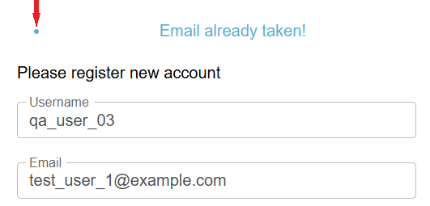  

**Log In Page**  
  
  
  

**Create Spoiler Page**  
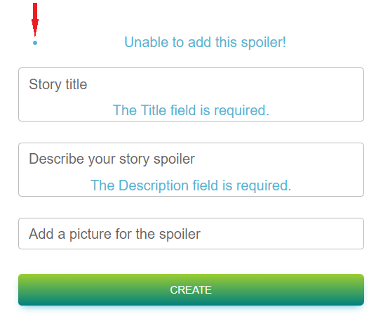  
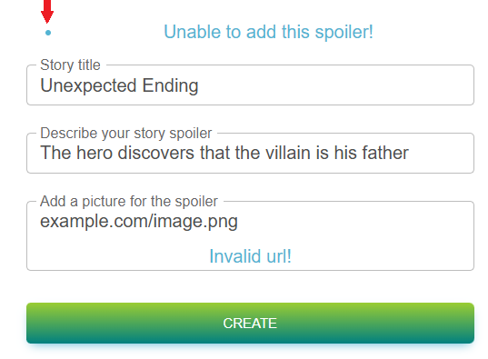  
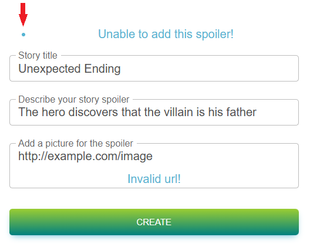  
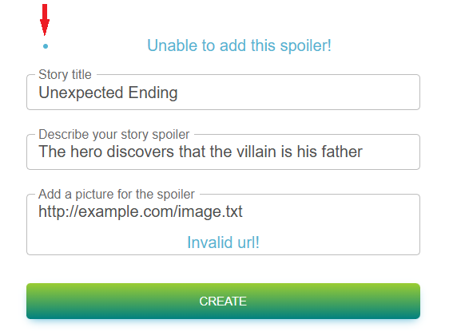  
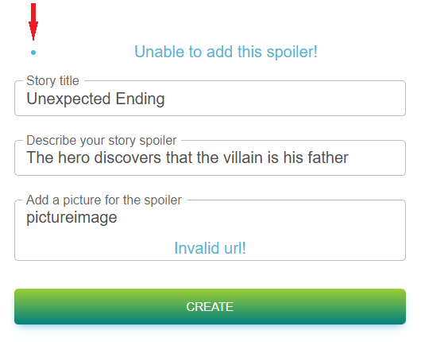  

**Status:** Open

---

## QRY-UX-02 – Inconsistent "ADD" button label across multiple pages

**Jira Query:** [SSQ-61](https://storyspoilerqa.atlassian.net/browse/SSQ-61)  
**Related Test Cases:**
- [TC-PROF-04](../test-cases/test-cases-user-profile-management.md#tc-prof-04--verify-edit-profile-info-page) (Jira link: [SSQ-101](https://storyspoilerqa.atlassian.net/browse/SSQ-101))

**Description:**  
The button used to confirm user actions is labeled "ADD" on several pages (e.g., Edit Profile Info, Log In). This label is misleading in contexts where users are expected to update or submit existing information rather than add new data.

**Steps to Identify:**  
1. Navigate to any of the following pages:  
   - Edit Profile Info
2. Observe the button label used to confirm the action.  

**Expected Result:**  
Buttons should have context-appropriate labels, e.g. "Save" or "Update" for profile/spoilers edits.

**Actual Result:**  
The confirmation button is labeled "ADD", which may confuse users regarding the action being performed.

**Status:** Open

---

