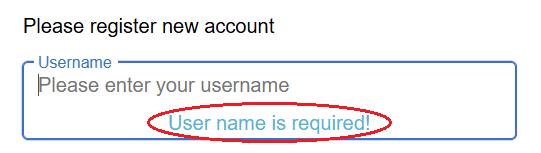
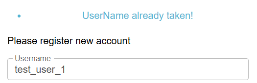
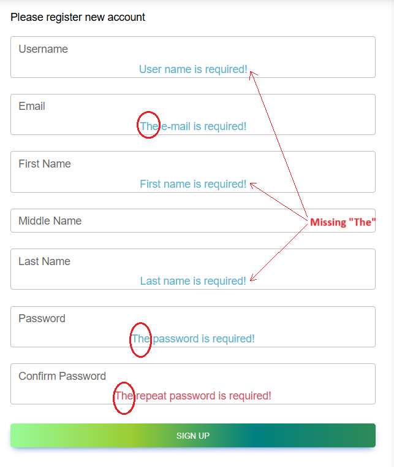
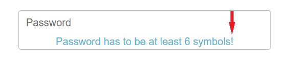
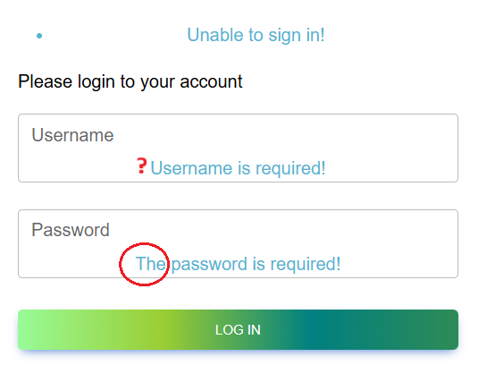
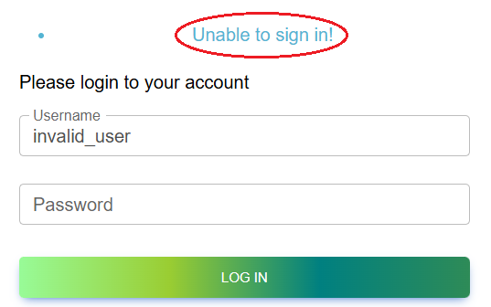
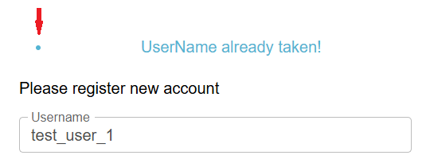
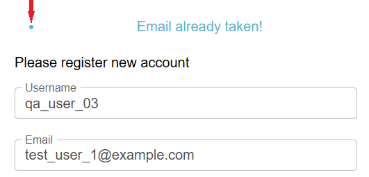

# Queries – Home Page

This document lists all open queries identified during requirements and test case analysis.
Each query has a unique ID (QRY-HP-XX), is linked to Jira, and references the related test case(s).
These issues are not strictly functional bugs but require clarification and alignment with stakeholders.
Screenshots are stored in the `docs/screenshots/` folder.

---

## QRY-HP-01 – Requirements for Home Page for logged in users lack visuals and detailed content specification

**Jira query:** [SSQ-27](https://storyspoilerqa.atlassian.net/browse/SSQ-27)  
**Related Test Case:** [TC-HP-08](../test-cases/test-cases-home-page.md#tc-hp-08--verify-home-page-for-logged-in-users) (Jira: [SSQ-13](https://storyspoilerqa.atlassian.net/browse/SSQ-13))

**Description:**
The original requirement document for the **Home Page (Logged-in User)** is incomplete. It lacks visuals and detailed text specification. Without them, developers and testers cannot reliably build or validate the feature.

**Steps to Identify:**

1. Open the oiginal requirement document.
2. Navigate to the section "Home Page (Logged-in User)".

**Expected:**
The requirement should contain a clear visual alongside a detailed description of:

* Page title and welcome message
* Content and layout of the body
* Labels/icons for navigation (Home, Profile, etc.)

**Actual:**

* No visuals provided
* Text description is incomplete and ambiguous

**Status:** ⏳ Open

---

## QRY-HP-02 – Home Page for logged-in users navigation link label

**Jira Query:** [SSQ-28](https://storyspoilerqa.atlassian.net/browse/SSQ-28)  
**Related Test Case:** [TC-HP-11](../test-cases/test-cases-home-page.md#tc-hp-11--verify-storyspoil-home-link-for-logged-in-users) (Jira: [SSQ-16](https://storyspoilerqa.atlassian.net/browse/SSQ-16))

**Description:**
Original requirement document states the navigation bar should display "**StorySpoil**" (mixed case), but both the mockup and current implementation show "**STORYSPOIL**" (all caps).

**Steps to Identify:**

1. Open the original requirement document.
2. Compare with the attached mockup.
3. Verify the implemented navigation bar in the app.

**Expected:**
Text formatting should be consistent between requirement, design mockup, and implementation.

**Actual:**
Requirement text differs from both design and implementation.

**Status:** ⏳ Open

---

## QRY-REG-01 – Consistency of capitalization in field names

* **Jira Query:** [SSQ-59](https://storyspoilerqa.atlassian.net/browse/SSQ-59) 
* **Related Test Cases:** 
- [TC-REG-20](../test-cases/test-cases-user-registration.md#tc-reg-20--verify-validation-for-existing-username-reuse) (Jira: [SSQ-53](https://storyspoilerqa.atlassian.net/browse/SSQ-53))
- [TC-REG-04](../test-cases/test-cases-user-registration.md#tc-reg-04--verify-validation-for-all-required-fields) (Jira: [SSQ-40](https://storyspoilerqa.atlassian.net/browse/SSQ-40))

**Description:**
Error messages use inconsistent capitalization for field names (e.g., `"UserName already taken!"` vs. `"User name is required!"`).

**Steps to Identify:**

1. Open the app URL.
2. Navigate to Sign Up page.
3. In the Username field, enter duplicate (TD-02) or invalid (empty) usernames to trigger different validation messages.

**Expected Result:**
Error messages should follow a consistent capitalization style (e.g., "Username").

**Actual Result:**
Field names are inconsistently capitalized across error messages.

### Screenshots

**Status:** ⏳ Open

---

## QRY-REG-02 – Consistency of required field messages

* **Jira Query:** [SSQ-63](https://storyspoilerqa.atlassian.net/browse/SSQ-63) 
* **Related Test Case:** [TC-REG-04](../test-cases/test-cases-user-registration.md#tc-reg-04--verify-validation-for-all-required-fields) (Jira: [SSQ-53](https://storyspoilerqa.atlassian.net/browse/SSQ-53))

**Description:**
Required field messages are inconsistent:

* `"User name is required!"`
* `"The e-mail is required!"`
* `"First name is required!"`
* `"The password is required!"`

**Steps to Identify:**
Trigger required field validation across different fields.

**Expected Result:**
Required messages should follow a consistent format (e.g., `"<Field> is required!"`).

**Actual Result:**
Some messages start with "The", others don’t.

### Screenshot

**Status:** ⏳ Open

---

## QRY-REG-03 – Validation messages tone and punctuation consistency

* **Jira Query:** [SSQ-64](https://storyspoilerqa.atlassian.net/browse/SSQ-64) 
* **Related Test Cases:** 
- [TC-REG-17](../test-cases/test-cases-user-registration.md#tc-reg-17--verify-validation-for-invalid-password-too-short) (Jira: [SSQ-50](https://storyspoilerqa.atlassian.net/browse/SSQ-50))
- [TC-REG-19](../test-cases/test-cases-user-registration.md#tc-reg-19--verify-validation-for-invalid-repeat-password-mismatched) (Jira: [SSQ-52](https://storyspoilerqa.atlassian.net/browse/SSQ-52))

**Description:**
Inconsistent punctuation:

* `"Password has to be at least 6 symbols!"` (exclamation mark).
* `"Passwords don't match."` (period).

**Steps to Identify:**
1. Open the app URL.
2. Navigate to Sign Up page.
3. In the Password field, enter very short password (TD-22), or in the Confirm Password field, enter incorrect repeat password (TD-24) to trigger validation messages.

**Expected Result:**
All error messages should use consistent punctuation.

**Actual Result:**
Error messages mix exclamation marks and periods.

### Screenshots

**Status:** ⏳ Open

---

## QRY-REG-04 – Label discrepancy for "Repeat Password" vs. "Confirm Password"

* **Jira Query:** [SSQ-65](https://storyspoilerqa.atlassian.net/browse/SSQ-65) 
* **Related Test Case:** [TC-REG-01](../test-cases/test-cases-user-registration.md#tc-reg-01--verify-sign-up-page) (Jira: [SSQ-34](https://storyspoilerqa.atlassian.net/browse/SSQ-34))

**Description:**
In the original requirements document, the field label is described as "Repeat password", but the image shows "Confirm password". The application also uses "Confirm password".

**Steps to Identify:**

1. Open the original requirements document.
2. Navigate to the section Sign Up Page.
3. Compare the field label in the text vs. the image and application.

**Expected Result:**
There should be no inconsistency between requirement description, UI design, and app implementation.

**Actual Result:**
Requirements specify "Repeat password", but design and app show "Confirm password".

**Status:** ⏳ Open

---

## QRY-REG-05 – Required field indicators not defined in requirements

* **Jira Query:** [SSQ-66](https://storyspoilerqa.atlassian.net/browse/SSQ-66) 
* **Related Test Case:** [TC-REG-04](../test-cases/test-cases-user-registration.md#tc-reg-04--verify-validation-for-all-required-fields) (Jira: [SSQ-40](https://storyspoilerqa.atlassian.net/browse/SSQ-40))

**Description:**
It is not mentioned in the original requirements document whether required fields should be visually marked. The app currently does not display required field indicators (e.g., red asterisk).

**Steps to Identify:**

1. Open the requirements document.
2. Navigate to Sign Up Page.
3. Compare field specifications with actual UI.

**Expected Result:**
Requirements should specify if required fields must be visually indicated.

**Actual Result:**
No indicators are defined or displayed.

**Status:** ⏳ Open

---

## QRY-REG-06 – Missing character type constraints for all input fields

* **Jira Query:** [SSQ-68](https://storyspoilerqa.atlassian.net/browse/SSQ-68) 
* **Related Test Cases:** 
- [TC-REG-02](../test-cases/test-cases-user-registration.md#tc-reg-02--verify-registration-with-valid-data-without-optional-middle-name) (Jira: [SSQ-35](https://storyspoilerqa.atlassian.net/browse/SSQ-35))
- [TC-REG-03](../test-cases/test-cases-user-registration.md#tc-reg-03--verify-registration-with-valid-data-with-optional-middle-name) (Jira: [SSQ-39](https://storyspoilerqa.atlassian.net/browse/SSQ-39))

**Description:**
The original requirements document defines only the minimum and maximum character lengths for each registration field but does not specify permitted or prohibited character types (e.g., special characters, digits, spaces, symbols).

**Steps to Identify:**

1. Review the original requirements document section "Sign Up Page".
2. Observe that no field-level constraints are mentioned for character types.
3. Compare with actual app behavior (fields accept a wide range of symbols and special characters).

**Expected Result:**
The requirements should specify which character types are allowed or disallowed for each field (e.g., only letters for names, alphanumeric for usernames, etc.).

**Actual Result:**
Only field length constraints are defined; no character-type restrictions are mentioned.

**Status:** ⏳ Open

---

## QRY-REG-07 – Missing user agreement or terms acceptance step

* **Jira Query:** [SSQ-69](https://storyspoilerqa.atlassian.net/browse/SSQ-69) 
* **Related Test Case:** [TC-REG-01](../test-cases/test-cases-user-registration.md#tc-reg-01--verify-sign-up-page) (Jira: [SSQ-34](https://storyspoilerqa.atlassian.net/browse/SSQ-34))

**Description:**
The Sign Up form does not include an option for users to agree to Terms and Conditions or Privacy Policy, nor is this requirement defined in the original requirements document.

**Steps to Identify:**

1. Open the app URL.
2. Navigate to Sign Up Page.
3. Observe that the registration form contains no checkbox or link for legal agreements.
4. Review the original requirements document "Sign Up Page" section for confirmation.

**Expected Result:**
Requirements and UI should include a step for users to explicitly agree to Terms of Service or Privacy Policy before account creation.

**Actual Result:**
No such checkbox or acceptance step exists in the current implementation or in the documented requirements.

**Status:** ⏳ Open

---

## QRY-LOG-01 – Consistency of required field messages

* **Jira Query:** [SSQ-85](https://storyspoilerqa.atlassian.net/browse/SSQ-85)
* **Related Test Case:** [TC-LOG-03](../test-cases/test-cases-log-in-page.md#tc-log-03--verify-validation-for-required-fields) (Jira: [SSQ-79](https://storyspoilerqa.atlassian.net/browse/SSQ-79))

**Description:**
Required field messages are inconsistent:

* `"Username is required!"`
* `"The password is required!"`

**Steps to Identify:**
1. Open the app URL.
2. Navigate to Log In page.
3. Leave the Username and Password fields empty (TD-31).
4. Click "LOG IN" button.

**Expected Result:**
Required messages should follow a consistent format (e.g., `"<Field> is required!"`).

**Actual Result:**
One message starts with "The", the other doesn’t.

### Screenshot

---

## QRY-LOG-02 – Generic error message for invalid login credentials

* **Jira Query:** [SSQ-86](https://storyspoilerqa.atlassian.net/browse/SSQ-86) 
* **Related Test Cases:** 
- [TC-LOG-04](../test-cases/test-cases-log-in-page.md#tc-log-04--verify-validation-for-invalid-username) (Jira: [SSQ-80](https://storyspoilerqa.atlassian.net/browse/SSQ-80))
- [TC-LOG-05](../test-cases/test-cases-log-in-page.md#tc-log-05--verify-validation-for-invalid-password) (Jira: [SSQ-81](https://storyspoilerqa.atlassian.net/browse/SSQ-81))

**Description:**
When attempting to log in with an invalid username or incorrect password, the system displays a generic error message `"Unable to sign in!"`.

**Steps to Identify:**

1. Open the app URL.
2. Navigate to Log In page.
3. Enter invalid username (TD-04) and valid password (TD-04) or valid username (TD-30) and incorrect password (TD-30) in the Password field.
4. Click "LOG IN" button.

**Expected Result:**
System should display more specific validation message (e.g., `"Invalid username/password"`).

**Actual Result:**
The error message is generic. No clarification is provided on whether the issue is with the username or the password.  

### Screenshots

---

## QRY-UX-01 – Extra bullet point before error messages across multiple forms

**Jira Query:** [SSQ-60](https://storyspoilerqa.atlassian.net/browse/SSQ-60)

**Related Test Cases:**  
- [TC-REG-20](../test-cases/test-cases-user-registration.md#tc-reg-20--verify-validation-for-existing-username-reuse) (Jira: [SSQ-53](https://storyspoilerqa.atlassian.net/browse/SSQ-53))
- [TC-REG-21](../test-cases/test-cases-user-registration.md#tc-reg-21--verify-validation-for-existing-email-reuse) (Jira: [SSQ-54](https://storyspoilerqa.atlassian.net/browse/SSQ-54))
- [TC-LOG-03](../test-cases/test-cases-log-in-page.md#tc-log-03--verify-validation-for-required-fields) (Jira: [SSQ-79](https://storyspoilerqa.atlassian.net/browse/SSQ-79))
- [TC-LOG-04](../test-cases/test-cases-log-in-page.md#tc-log-04--verify-validation-for-invalid-username) (Jira: [SSQ-80](https://storyspoilerqa.atlassian.net/browse/SSQ-80))
- [TC-LOG-05](../test-cases/test-cases-log-in-page.md#tc-log-05--verify-validation-for-invalid-password) (Jira: [SSQ-81](https://storyspoilerqa.atlassian.net/browse/SSQ-81)) 

**Description:**  
An unnecessary bullet point ("•") appears before validation error messages across multiple pages, including the Sign Up and Log In forms.

**Steps to Identify:**  

**A. Sign Up Page**  
1. Open the app URL.  
2. Navigate to Sign Up page.  
3. In the Username field, enter existing username (TD-02) or existing email address (TD-29) to trigger validation messages.
4. Click "SIGN UP" button.  

**B. Log In Page**  
1. Open the app URL.  
2. Navigate to Log In page.  
3. Reproduce any of the following scenarios:  
   - Leave both Username and Password fields empty (TD-31).  
   - Enter an invalid username with a valid password (TD-02).  
   - Enter a valid username with an incorrect password (TD-32).  
4. Click the "LOG IN" button.   

**Expected Result:**  
All error messages should display cleanly, without any preceding bullet point or formatting artifacts.

**Actual Result:**  
Error messages across both pages display an unnecessary bullet point ("•") before the text.

**Screenshots:**  
**Sign Up Page**  
-   
-   

**Log In Page**  
-   
-   
- 

**Status:** ⏳ Open

---

## QRY-UX-02 – Inconsistent "ADD" button label across multiple pages

**Jira Query:** [SSQ-61](https://storyspoilerqa.atlassian.net/browse/SSQ-61)  
**Related Test Cases:**
- [TC-PROF-04](../test-cases/test-cases-user-registration.md#tc-prof-04--verify-user-can-edit-their-profile) (Jira: [SSQ-96](https://storyspoilerqa.atlassian.net/browse/SSQ-96))

**Description:**  
The button used to confirm user actions is labeled "ADD" on several pages (e.g., Edit Profile Info, Log In). This label is misleading in contexts where users are expected to update or submit existing information rather than add new data.

**Steps to Identify:**  
1. Navigate to any of the following pages:  
   - Edit Profile Info
2. Observe the button label used to confirm the action.  

**Expected Result:**  
Buttons should have context-appropriate labels, e.g. "Save" or "Update" for profile/spoilers edits.

**Actual Result:**  
The confirmation button is labeled "ADD", which may confuse users regarding the action being performed.

---

